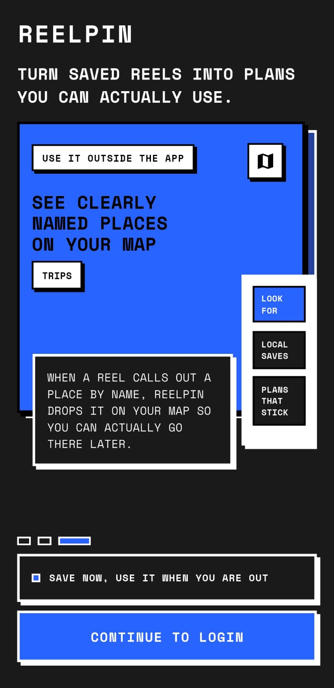
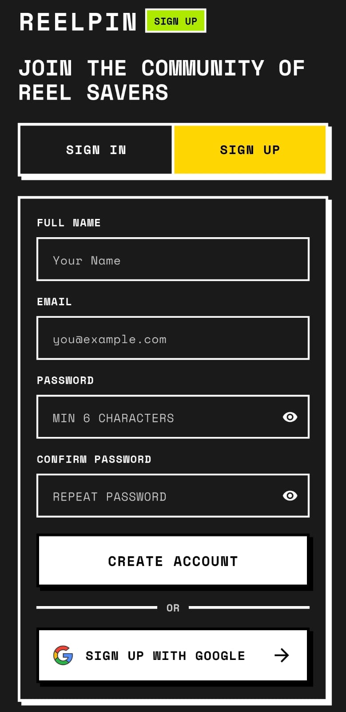
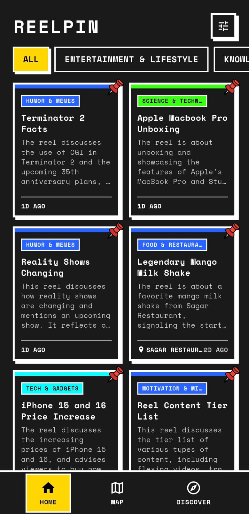
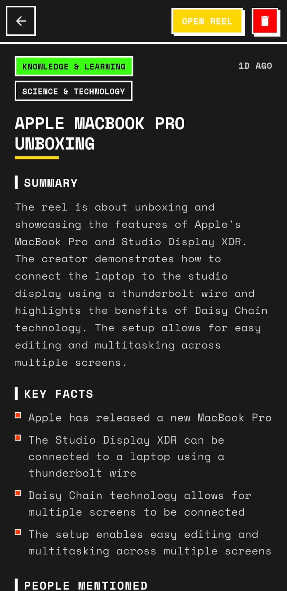
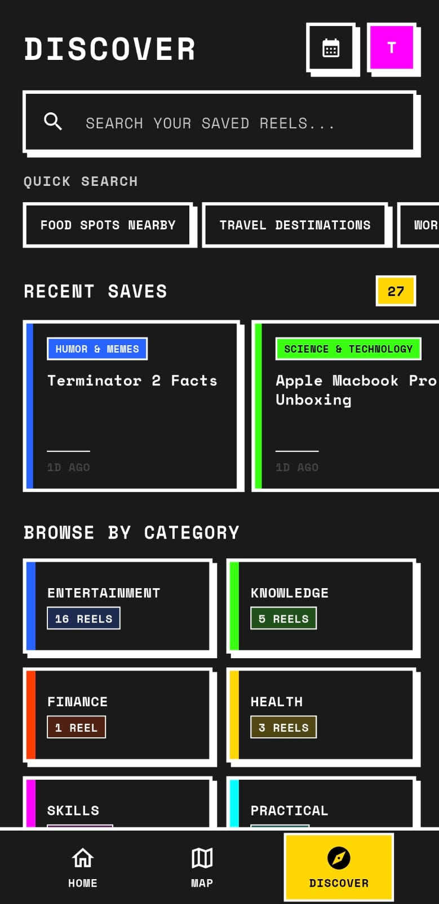
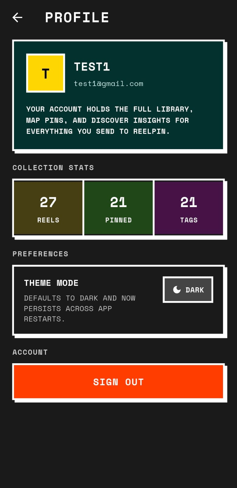
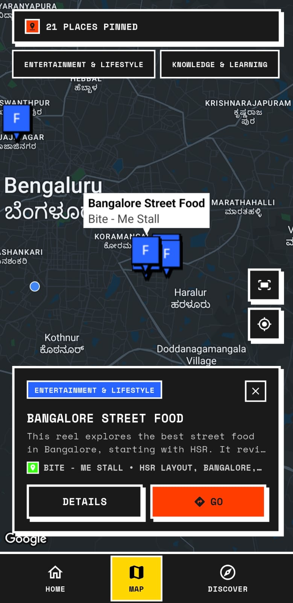

# ReelPin

ReelPin is a Flutter app for saving reels, posts, and shorts that you want to come back to later.

You share a link into ReelPin, the backend processes it in the background, and the app turns that saved post into something easier to browse: summaries, key facts, locations, people mentioned, category filters, map pins, and searchable saved results.

## Screenshots

<table>
  <tr>
    <td align="center">
      
      <br>
      <sub>Onboarding</sub>
    </td>
    <td align="center">
      
      <br>
      <sub>Auth</sub>
    </td>
    <td align="center">
      
      <br>
      <sub>Home</sub>
    </td>
  </tr>
  <tr>
    <td align="center">
      
      <br>
      <sub>Discover</sub>
    </td>
    <td align="center">
      
      <br>
      <sub>Profile</sub>
    </td>
    <td align="center">
      
      <br>
      <sub>Reel Detail</sub>
    </td>
  </tr>
  <tr>
    <td align="center" colspan="3">
      
      <br>
      <sub>Map</sub>
    </td>
  </tr>
</table>

## What The App Does

- Save Instagram reels, posts, TikToks, and YouTube Shorts by sharing them into ReelPin.
- Queue background processing jobs instead of blocking the user in the foreground.
- Show a share confirmation popup when a reel is accepted for background processing.
- Register the device for push notifications and refresh the saved library when a reel is ready.
- Browse saved reels from a card-based Home screen.
- Search saved reels from Discover with live search as you type.
- Filter saved reels by category and subcategory using the backend-driven category tree.
- Browse extracted places on a map with custom category-colored pins.
- Open a detail view with summary, facts, transcript, locations, people mentioned, and action items.
- Follow the device theme by default, with a manual theme override in Profile.

## Main Screens

### Home

Home is the main saved-reel feed. It shows:

- Saved reels in a responsive grid
- Category chips across the top
- A filter sheet for category and subcategory selection
- Long-press deletion from reel cards

### Discover

Discover is for search and browsing. It includes:

- Live search while typing
- Quick search prompts
- Recent saves
- Date-based browsing
- Category browsing cards

### Map

Map shows places extracted from saved reels. It includes:

- Custom category-colored pins
- Category filtering
- A bottom sheet for the selected reel and place
- Direct navigation out to Google Maps

### Reel Detail

The detail screen includes:

- Category and subcategory badges
- Open original reel action
- Delete action
- Summary
- Key facts
- Locations
- People mentioned
- Action items
- Expandable transcript

### Profile

Profile shows:

- Collection stats
- Theme toggle
- Account sign out

## Share And Processing Flow

The app is built around the Android and iOS share flow.

1. You share a supported reel or post into ReelPin.
2. ReelPin extracts the URL and queues a background processing job.
3. The app shows a short confirmation popup that the reel was saved and is processing in the background.
4. The backend worker processes the content asynchronously.
5. When the backend sends a `reel_ready` notification, the app refreshes the saved library.

The app does not wait for processing to finish in the foreground.

## Tech Stack

- Flutter
- Provider
- Supabase auth and profile storage
- Firebase Cloud Messaging
- flutter_local_notifications
- google_maps_flutter
- receive_sharing_intent

## Backend Contract

This app expects a ReelPin backend with these endpoints:

- `POST /api/v1/processing-jobs/reels`
- `GET /api/v1/processing-jobs/{job_id}`
- `GET /api/v1/reels`
- `GET /api/v1/reels/category-filters`
- `POST /api/v1/search`
- `POST /api/v1/device-push-tokens`

The app uses the backend category-filter tree for its filter UI. It does not rely on a hardcoded category list anymore.

## Local Setup

### Prerequisites

- Flutter SDK
- Android Studio and/or Xcode
- A running ReelPin backend
- A Supabase project
- A Google Maps API key
- Firebase project files for push notifications

### Supabase Config

Create:

```text
assets/config/local.env
```

Example:

```env
SUPABASE_URL=https://YOUR_PROJECT_REF.supabase.co
SUPABASE_ANON_KEY=YOUR_SUPABASE_ANON_KEY
SUPABASE_REDIRECT_SCHEME=com.chetan.reelpin
SUPABASE_REDIRECT_HOST=login-callback
API_BASE_URL=https://YOUR_BACKEND/api/v1
```

### Android Maps Config

Create:

```text
android/local.properties
```

Add:

```properties
MAPS_API_KEY=YOUR_GOOGLE_MAPS_API_KEY
```

### Firebase Config

Add the Firebase files for the app package:

- `android/app/google-services.json`
- `ios/Runner/GoogleService-Info.plist`

Without these files, real-device push notifications will not work.

### Android Release Signing

Release builds require:

```text
android/key.properties
```

With:

```properties
keyAlias=...
keyPassword=...
storeFile=...
storePassword=...
```

## Run The App

```bash
flutter pub get
flutter run
```

## Useful Commands

Analyze:

```bash
flutter analyze
```

Build release APK:

```bash
flutter build apk
```

## Notes

- Theme follows the device by default unless the user changes it from Profile.
- Category colors are stable across the app and do not depend on the order of loaded categories.
- The filter sheet uses backend-driven categories and subcategories, with a local fallback derived from saved reels if the category endpoint is unavailable.
