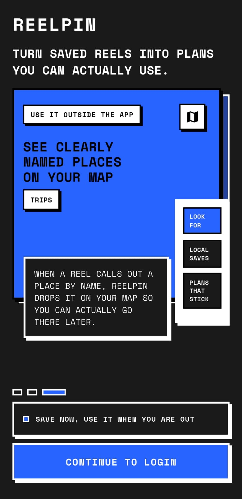
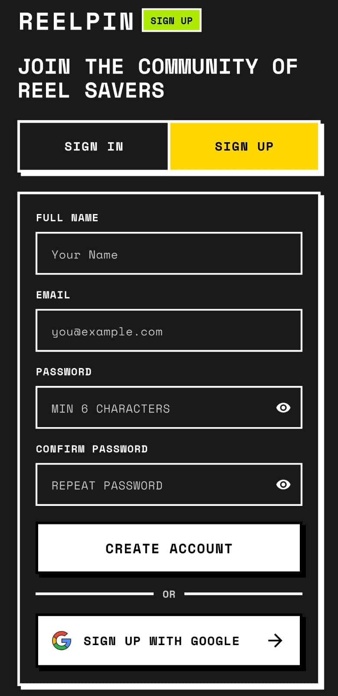
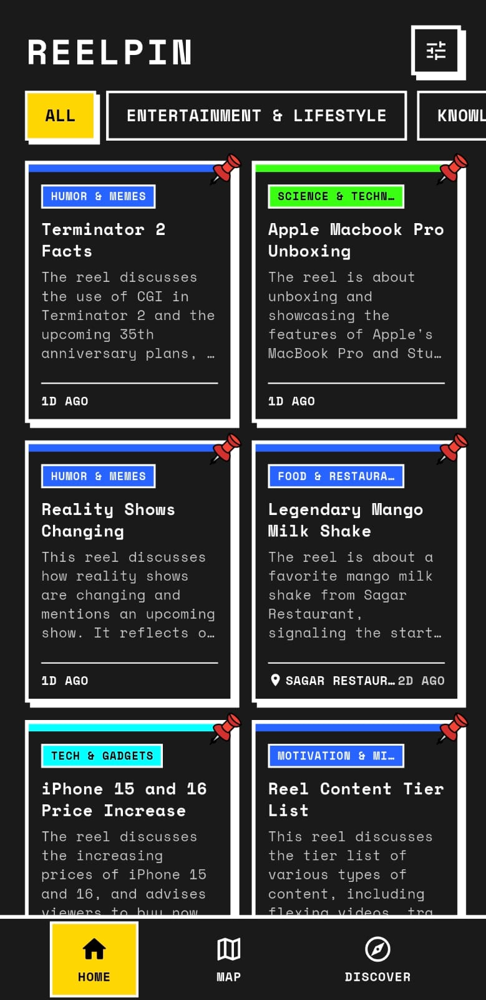
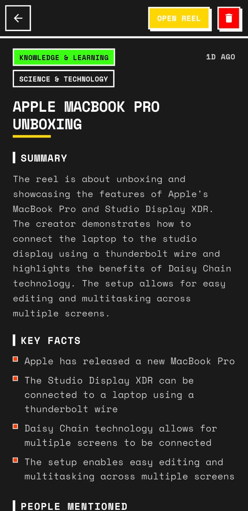
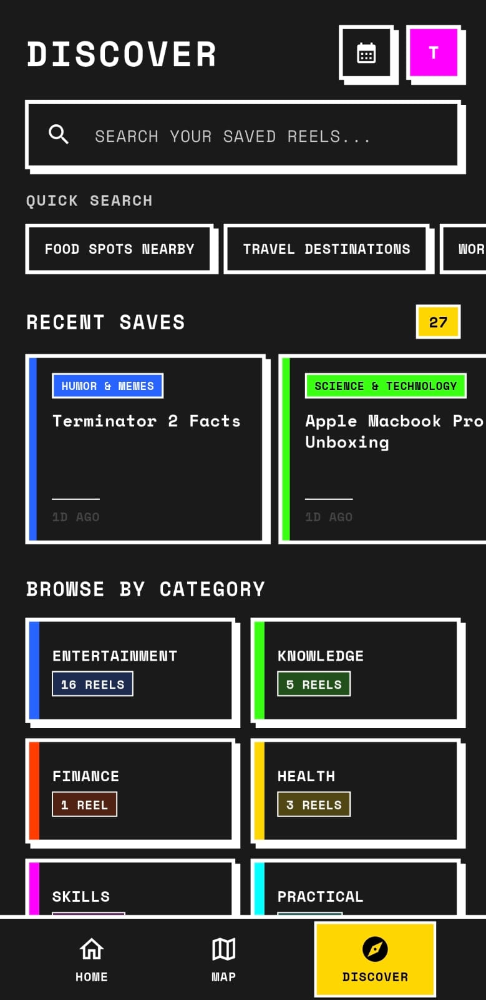
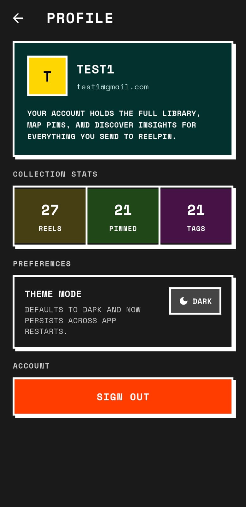
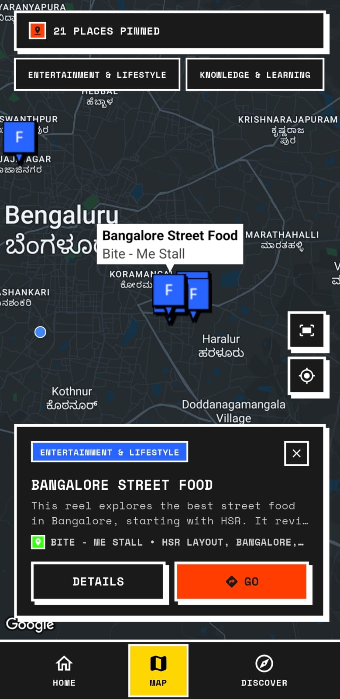

# ReelPin

ReelPin is a Flutter app for saving reels, posts, and shorts that you want to come back to later.

You share a link into ReelPin, the backend processes it in the background, and the app turns that saved post into something easier to browse: summaries, key facts, locations, people mentioned, category filters, map pins, and searchable saved results.

## Screenshots

<table>
  <tr>
    <td align="center">
      
      <br>
      <sub>Onboarding</sub>
    </td>
    <td align="center">
      
      <br>
      <sub>Auth</sub>
    </td>
    <td align="center">
      
      <br>
      <sub>Home</sub>
    </td>
  </tr>
  <tr>
    <td align="center">
      
      <br>
      <sub>Discover</sub>
    </td>
    <td align="center">
      
      <br>
      <sub>Profile</sub>
    </td>
    <td align="center">
      
      <br>
      <sub>Reel Detail</sub>
    </td>
  </tr>
  <tr>
    <td align="center" colspan="3">
      
      <br>
      <sub>Map</sub>
    </td>
  </tr>
</table>

## What The App Does

- Save reels, posts, and links by sharing them into ReelPin. The backend accepts many sources (Instagram, TikTok, YouTube, X, Reddit, LinkedIn, Pinterest, and plain links); which sources are supported is driven by the backend, not the app.
- Queue background processing jobs instead of blocking the user in the foreground.
- Show a share confirmation popup when a reel is accepted for background processing.
- Register the device for push notifications and refresh the saved library when a reel is ready.
- Browse saved reels from a card-based Home screen.
- Search saved reels from Discover with live search as you type.
- Filter saved reels by category and subcategory using the backend-driven category tree.
- Browse extracted places on a map with custom category-colored pins.
- Open a detail view with summary, facts, transcript, locations, people mentioned, and action items.
- Follow the device theme by default, with a manual theme override in Profile.

## Main Screens

### Home

Home is the main saved-reel feed. It shows:

- Saved reels in a responsive grid
- Category chips across the top
- A filter sheet for category and subcategory selection
- Long-press deletion from reel cards

### Discover

Discover is for search and browsing. It includes:

- Live search while typing
- Quick search prompts
- Recent saves
- Date-based browsing
- Category browsing cards

### Map

Map shows places extracted from saved reels. It includes:

- Custom category-colored pins
- Category filtering
- A bottom sheet for the selected reel and place
- Direct navigation out to Google Maps

### Reel Detail

The detail screen includes:

- Category and subcategory badges
- Open original reel action
- Delete action
- Summary
- Key facts
- Locations
- People mentioned
- Action items
- Expandable transcript

### Profile

Profile shows:

- Collection stats
- Theme toggle
- Account sign out

## Share And Processing Flow

The app is built around the Android and iOS share flow.

1. You share a supported reel, post, or link into ReelPin.
2. ReelPin extracts the URL and queues a background processing job.
3. The app shows a short confirmation popup that the reel was saved and is processing in the background.
4. The backend worker processes the content asynchronously: download, transcribe, extract structured data (title, summary, locations, key facts, people, action items), embed, and store.
5. When the backend sends a `reel_ready` push notification, the app refreshes the saved library.

The app does not wait for processing to finish in the foreground.

### Native Share Handoff

Android can enqueue a share in a background process that runs before Flutter is up, and that native code cannot read the DataStore where the Flutter `shared_preferences` plugin keeps its values. To bridge this, `lib/services/sharing/share_handoff_service.dart` mirrors the values the background enqueue needs (user id, access token, API base URL, push token and platform, share token) into a native-owned store through `MethodChannel('com.chetanjain.reelpin/share_handoff')`. When you change what the background share needs, update both the Flutter setters here and the matching native side.

## Tech Stack

- Flutter (Dart SDK 3.11+)
- Riverpod (`flutter_riverpod`) for state
- Supabase (`supabase_flutter`) for auth (Google and Apple sign-in) and profile storage
- Firebase Cloud Messaging (`firebase_messaging`) and `flutter_local_notifications` for push
- `google_maps_flutter` for the map, with `geolocator` and `geocoding`
- `receive_sharing_intent` for the share intake
- `in_app_update` for Android in-app updates
- `webview_flutter`, `url_launcher`, `google_fonts`, `shimmer`, `hugeicons`

## Backend Contract

This app expects a ReelPin backend with these endpoints:

- `POST /api/v1/processing-jobs/reels`
- `GET /api/v1/processing-jobs/{job_id}`
- `GET /api/v1/reels`
- `GET /api/v1/reels/category-filters`
- `POST /api/v1/search`
- `POST /api/v1/device-push-tokens`

The app uses the backend category-filter tree for its filter UI. It does not rely on a hardcoded category list anymore.

## Branches And Promotion

`dev` is the working branch and `main` is what ships to the stores. A push to
`dev` triggers `.github/workflows/build-dev-apk.yml` (debug APK) and
`validate.yml`; `main` is what you cut a release build from.

1. **Never push directly to `main`.** It moves only by merging a pull request
   from `dev`, or from a short-lived branch cut off `dev`.
2. **`dev` must always contain `main`.** Before starting work and again before
   opening a promotion PR, merge `origin/main` into `dev`. If that merge changes
   files, someone committed to `main` out of band.
3. **Promote with a merge, not a rebase.** `dev` is shared and already pushed, so
   a rebase would need a force-push.
4. **After a promotion lands on `main`, merge `main` back down into `dev`.** A
   promotion adds a merge commit to `main` that `dev` lacks, which is how the two
   drift while their trees stay identical.
5. **Never force-push `dev` or `main`.**

`git rev-list --left-right --count origin/main...dev` tells you where you stand.
The left number is commits only on `main` and should be zero before you promote.

## Local Setup

### Prerequisites

- Flutter SDK
- Android Studio and/or Xcode
- A running ReelPin backend
- A Supabase project
- A Google Maps API key
- Firebase project files for push notifications

### Runtime Config

Put local runtime config in the ignored file:

```text
assets/config/local.env
```

Example:

```text
SUPABASE_URL=https://YOUR_PROJECT_REF.supabase.co
SUPABASE_ANON_KEY=YOUR_SUPABASE_ANON_KEY
API_BASE_URL=https://api-dev.reelpin.in
MAPS_API_KEY=YOUR_GOOGLE_MAPS_API_KEY
```

Use the project command so Supabase and the selected backend are always passed
as Dart defines:

```bash
tool/reelpin.sh run-dev
```

Run against production:

```bash
tool/reelpin.sh run-production
```

List available devices, then pass a simulator or emulator ID to either command:

```bash
flutter devices
tool/reelpin.sh run-dev -d <device-id>
tool/reelpin.sh run-production -d <device-id>
```

`run-dev` uses `https://api-dev.reelpin.in`. `run-production` uses
`https://api.reelpin.in`.

#### How Config Resolves

`lib/env.dart` picks the API base URL. An `API_BASE_URL` Dart define always
wins; otherwise release builds use production (`https://api.reelpin.in`) and
every other build uses dev (`https://api-dev.reelpin.in`). Those are the only
two hosts — point a build at a local server with the Dart define rather than
adding a constant.

`lib/env.dart` also reads `SUPABASE_URL` and
`SUPABASE_ANON_KEY` only from Dart defines (`String.fromEnvironment`); it does
not read `assets/config/local.env` at runtime. The wrapper is what turns the
values in `local.env` into `--dart-define` flags before Flutter starts. The
Supabase OAuth redirect scheme is chosen per platform:
`com.chetanjain.reelpin` on Android and `com.chetan.reelpin` elsewhere.

To run the raw Flutter toolchain without the wrapper, pass the same defines
yourself, for example:

```bash
flutter run \
  --dart-define=API_BASE_URL=http://<your-lan-ip>:8000/api/v1 \
  --dart-define=SUPABASE_URL=... \
  --dart-define=SUPABASE_ANON_KEY=...
```

The usual `flutter pub get`, `flutter test`, `flutter analyze`, and
`flutter build appbundle` / `flutter build apk` all work, but without the
defines above Supabase and the backend URL will not be configured.

Clean Flutter build output without deleting saved release artifacts:

```bash
tool/reelpin.sh clean
```

Build a signed release APK with the development backend. This APK is for testing
and must not be uploaded to Play Console:

```bash
tool/reelpin.sh apk-dev
```

Build a signed release APK with the production backend:

```bash
tool/reelpin.sh apk-production
```

Both APK commands clean the project, install dependencies, run the project
checks, and save versioned APKs as:

```text
artifacts/releases/<version>/reelpin-<version>-dev.apk
artifacts/releases/<version>/reelpin-<version>-production.apk
```

The command reads `assets/config/local.env` from disk before Flutter runs. That
file is git-ignored and is not packaged as a Flutter asset.

### Store Release Builds

The release commands create files that are ready to upload. They do not change
the version, increment the build number, or upload anything.

Before each release, update the version in `pubspec.yaml` yourself:

```yaml
version: 1.0.9+15
```

The value before `+` is the Android version name and iOS marketing version. The
number after `+` is the Android version code and iOS build number. Both stores
require a build number greater than the last uploaded build.

Confirm the version without changing it:

```bash
tool/reelpin.sh version
```

Check the complete local release setup without building:

```bash
tool/reelpin.sh doctor
```

The local preflight also checks that the app uses these Supabase OAuth callback
URLs:

```text
com.chetanjain.reelpin://login-callback
com.chetan.reelpin://login-callback
```

Keep both URLs in the Supabase Authentication redirect allowlist. Also keep the
Google provider enabled in Supabase and its Google OAuth callback configured in
Google Cloud. These are remote settings, so `doctor` cannot inspect them.

Build the production Play Store AAB:

```bash
tool/reelpin.sh playstore
```

Build the production App Store IPA:

```bash
tool/reelpin.sh appstore
```

Build both store files after running the checks once:

```bash
tool/reelpin.sh stores
```

Store commands run `flutter clean`, install dependencies, check formatting and
project structure, run analysis and tests, build with production configuration,
and verify the generated package IDs, versions, signing, and store capabilities.

The files and SHA-256 checksums are saved outside Flutter's build directory:

```text
artifacts/releases/<version>/reelpin-<version>-playstore.aab
artifacts/releases/<version>/reelpin-<version>-appstore.ipa
```

Running `flutter clean` later does not delete these files.

The iOS command expects the Apple Distribution certificate and both manual App
Store profiles from `ios/ExportOptions.plist` to be installed on the Mac. The
current profile names are `ReelPin App Store 2026` and
`ReelPin Share Extension App Store 2026`. Replace the profiles and update the
plist when they expire. The currently installed profiles expire on June 22,
2027.

The distribution certificate must include its private key. Check it with:

```bash
security find-identity -v -p codesigning
```

If this reports `0 valid identities found`, import the Apple Distribution
certificate and private key into the login keychain. You can import a `.p12`
backup in Keychain Access, or create/download the certificate from Xcode under
Settings, Accounts, your team, Manage Certificates. Run `tool/reelpin.sh doctor
ios` again after installing it.

Run `tool/reelpin.sh --help` to see every supported command. Use
`tool/reelpin_flutter.sh` only when you need to pass a raw Flutter command or
sync production values before opening Xcode directly.

If you archive from Xcode, sync the ignored iOS Dart defines first:

```bash
tool/reelpin_flutter.sh --reelpin-env=production sync-xcode
```

### Android Maps Config

You can keep the Google Maps key in `assets/config/local.env`, which works for Android and iOS when using the wrapper. Android also supports:

```text
android/local.properties
```

Add:

```properties
MAPS_API_KEY=YOUR_GOOGLE_MAPS_API_KEY
```

### Firebase Config

Add the Firebase files for the app package:

- `android/app/google-services.json`
- `ios/Runner/GoogleService-Info.plist`

Without these files, real-device push notifications will not work.

### Android Release Signing

Release builds require:

```text
android/key.properties
```

With:

```properties
keyAlias=...
keyPassword=...
storeFile=...
storePassword=...
```

## Run The App

```bash
tool/reelpin.sh run-dev
```

## Useful Commands

Run the same validation used by the store release commands:

```bash
tool/reelpin.sh verify
```

Check the Android release setup only:

```bash
tool/reelpin.sh doctor android
```

Check the iOS release setup only:

```bash
tool/reelpin.sh doctor ios
```

## Code Organization

The Flutter application uses a single package organized by layer rather than by feature. Each folder has one responsibility:

- `lib/screens/<screen_name>` holds one full page. Widgets used only by that page live in its `partials/` folder.
- `lib/components` holds widgets reused by more than one screen, grouped by area (`components/reels`).
- `lib/view_models` holds every `ChangeNotifier` state class, named `*_view_model.dart`.
- `lib/http` holds the backend endpoint groups (`*_http.dart`), the shared `ApiClient`, and `ApiException`.
- `lib/repositories` holds stateful caches layered over `http`, such as `ReelRepository`.
- `lib/data_models` holds data-only classes grouped by area (`data_models/reels`, `data_models/map`).
- `lib/services` holds platform and lifecycle integrations: authentication, location, notifications, sharing, caching, updates.
- `lib/constants` holds colors, spacing, layout, and theme. `lib/utils` holds pure helpers.
- The root files start and wire the app: `main.dart`, `bootstrap.dart`, `app_entry.dart`, `reelpin_app.dart`, `providers.dart`, `router.dart`, `env.dart`.

Dependencies only point downward. `constants` and `data_models` import nothing else from the app; `utils`, `http`, `services`, `repositories`, and `view_models` never import `screens` or `components`; and a screen may only use its own `partials/`. A widget that a second screen needs moves to `components`. `tool/check_architecture.dart` enforces these boundaries and the file naming rules for every change targeting `dev`.

Tests mirror the same folders under `test/`. When you change a layer, its production code and tests stay in matching folders.

## Notes

- Theme follows the device by default unless the user changes it from Profile.
- Category colors are stable across the app and do not depend on the order of loaded categories.
- The filter sheet uses backend-driven categories and subcategories, with a local fallback derived from saved reels if the category endpoint is unavailable.
